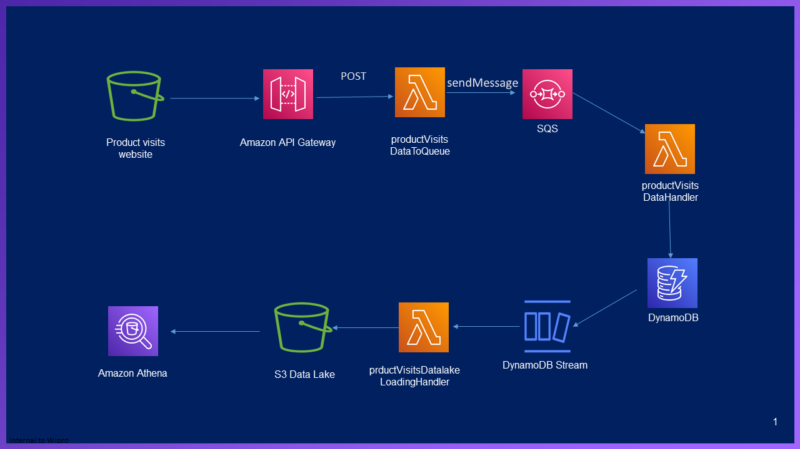

## Highlights

* Details on how to records details entered in the S3 website to DynamoDB and further save the files as JSON in S3 

## Architecture
<p align="center">
   
</p>

## Steps to replicate
## PART 1 - SQS - Lambda - DynamoDB Table ##
  
  1. Setup DynamoDB
  
     **1.1** Create Table "ProductVisits" with below fields with least provisioned capacity
     
	    **i.** ProductVisitKey as String and as a Partition key

  2. Setup SQS Queue
  
     **2.1** Create standard queue named "ProductVisitsDataQueue"      
				
		
  3. Create Lambda function
		
	 **3.1** Create role "lambdaRoleForSQSPermissions" and attach below AWS managed IAM policy
	 
		**i.**   "AmazonDynamoDBFullAccess"
		**ii.**  "CloudWatchLogsFullAccess"
		**iii.** "AWSLambdaSQSQueueExecutionRole"
		
     **3.2** Create Python Lambda "productVisitsDataHandler" for sending data to DynamoDB and add "lambdaRoleForSQSPermissions" role and copy the contents from "productVisitsDataHandler.py"
      
     **3.3** Go back to SQS and open "ProductVisitsDataQueue" and configure Lambda function trigger and specify Lambda function "productVisitsDataHandler"
	 
	 **3.4** Go to AWS CLI and send messages for testing by using the below command
	 ```bash
		`aws sqs send-message --queue-url https://sqs.us-east-1.amazonaws.com/9XXXXXXXXXX4/ProductVisitsDataQueue --message-body file://message-body-1.json`
	 ```
	 
## PART 2 - DynamoDB Streams - Lambda - S3 Data Lake ##

  1. Create S3 bucket "product-visits-datalake" and modify bucket name by adding letters/numbers at end to be unique
  
  2. Create a policy "productVisitsLoadingLambdaPolicy" and copy contents of "lambda-policy.json" and replace account number / region / names as required
  
  3. Create a role for Lambda called "productVisitsLoadingLambdaRole" and attach "productVisitsLoadingLambdaPolicy".
  
  4. Create Python Lambda "productVisitsDatalakeLoadingHandler" for sending data to S3 and add "productVisitsLoadingLambdaRole" role and copy the contents from "productVisitsDatalakeLoadingHandler.py"
    
  5. Go to "ProductVisits" dynamoDB-->"Export and stream"-->Enable Streams for "NEW IMAGE" and create a trigger and choose "productVisitsDatalakeLoadingHandler"
  
  
## PART 3 - S3 Static Website - API Gateway REST API - Lambda ##
  
  1. Create a policy "productVisitsSendMessageLambdaPolicy" and copy contents of "lambda-policy.json" and replace account number / region / names as required
  
  2. Create a role for Lambda called "productVisitsSendMessageLambdaRole" and attach "productVisitsSendMessageLambdaPolicy".
  
  3. Create Python Lambda "productVisitsSendDataToQueue" for sending data to SQS and add "productVisitsSendMessageLambdaRole" role and copy the contents from "productVisitsSendDataToQueue.py" (replace account number / region / names as required)
  
  4. Create Amazon API Gateway called "productVisit" with below details.
	**i.** Endpoint type : Regional
	**ii.** Resource name : productdetails
	**iii.** Resource path: /productdetails
	**iv.** Enable CORS
	**v.** Type: POST
	**vi.** Integration type: Lambda function
	**vii.** Function: productVisitsSendDataToQueue
	**viii.** Deploy API - Actions --> Deploy API -->new stage called "dev"
 
  5. Create a bucket with below details.
	**i.** Name: product-visits-webform
	**ii.** Updates: Add letters/numbers to bucket name to be unique
	**iii.** Region: us-east-1
	**iv.** Turn off block public access
	**v.** Enable static website hosting
	**vi.** Index: productDetails.html (replace account number / region / names as required)
	
	Use the below bucket policy
	```bash
		{
		"Version": "2012-10-17",
		"Statement": [
			{
				"Sid": "PublicRead",
				"Effect": "Allow",
				"Principal": "*",
				"Action": [
					"s3:GetObject",
					"s3:GetObjectVersion"
				],
				"Resource": "arn:aws:s3:::charleskamalanandpublic/*"
			}
		]
		}
	```